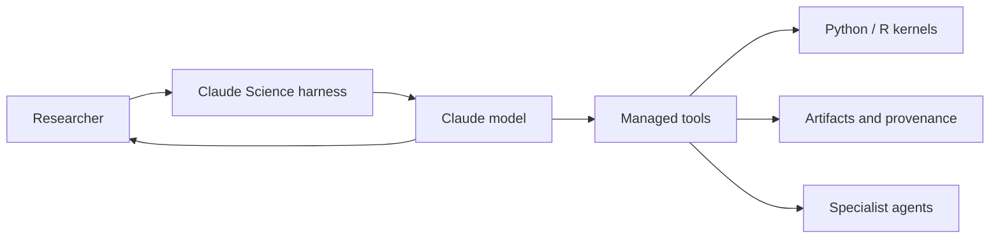

# Claude Science: System Prompts & Skills


Collection of Claude Science system prompts, reusable prompt fragments, and research-oriented agent skills.

## Start here

Most visitors are looking for one of these files:

| Looking for | Open |
|---|---|
| Claude Science Opus 5 system prompt | [Claude Science Opus 5](prompt/fragments/claude-science/system-prompts/claude-science-opus-5-system-prompt.md) |
| Claude Science Fable 5 system prompt | [Claude Science Fable 5](prompt/fragments/claude-science/system-prompts/claude-science-fable-5-system-prompt.md) |
| Scientific research skill | [Conducting scientific research](skills/conducting-scientific-research/SKILL.md) |
| Prompt fragments used by the Claude Science prompts | [Claude Science fragments](prompt/fragments/claude-science/) |

## Repository guide

```text
prompt/
├── system-prompts/                 Standard Claude system prompts
└── fragments/
    ├── claude-science/
    │   ├── system-prompts/         Complete Claude Science Opus 5 and Fable 5 prompts
    │   ├── common-before-behavior.md
    │   ├── opus-behavior.md
    │   ├── fable-behavior.md
    │   ├── common-after-behavior.md
    │   └── tools.md
    └── generic/                    Shared injections, commands, compaction, and tools

skills/
└── conducting-scientific-research/ Research workflow skill and reference material
```

### How files relate

- `prompt/fragments/claude-science/system-prompts/` contains ready-to-read, complete prompts. Start here.
- Other files under `prompt/fragments/claude-science/` are modular source sections of those prompts.
- `prompt/fragments/generic/` contains shared runtime-style fragments, not the main Claude Science prompts.
- Each skill starts at its `SKILL.md`; its `references/` directory provides supporting guidance.

## Claude Science overview

Claude Science is framed as a research workbench with persistent Python/R kernels, managed tool permissions, durable artifacts, and optional specialist-agent work.



## License

Licensed under [Creative Commons Attribution 4.0 International (CC BY 4.0)](LICENSE). Reuse requires appropriate attribution to [Shoko-official](https://github.com/Shoko-official).
