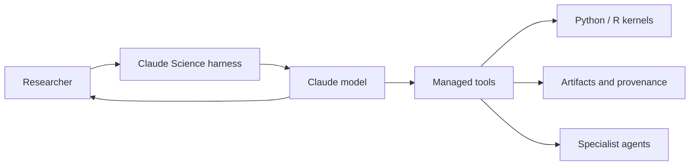

# Claude Science: Prompts, Skills, and MCP


System prompts, scientific skills, and Bio Research MCP configuration.

## Open directly

| Category | Files |
|---|---|
| General prompts | [Opus 5](prompts/general/opus-5-system-prompt.md), [Fable 5](prompts/general/fable-5-system-prompt.md) |
| Claude Science prompts | [Opus 5](prompts/claude-science/claude-science-opus-5-system-prompt.md), [Fable 5](prompts/claude-science/claude-science-fable-5-system-prompt.md) |
| Research workflow | [Conducting scientific research](skills/conducting-scientific-research/SKILL.md) |
| Bio Research setup | [Start skill](skills/bio-research-start/SKILL.md), [MCP configuration](mcp/bio-research/.mcp.json), [connector map](mcp/bio-research/CONNECTORS.md) |

## Architecture

```text
prompts/
├── general/                         General Opus 5 and Fable 5 prompts
│   └── fragments/                   Compaction, commands, reminders, and tools
└── claude-science/                  Complete Claude Science prompts
    └── fragments/                   Claude Science prompt components

skills/
├── conducting-scientific-research/  General scientific workflow
├── bio-research-start/              Bio Research orientation skill
├── clinical-trial-protocol/         Clinical protocol workflow
├── instrument-data-to-allotrope/    Instrument-data conversion
├── nextflow-development/            nf-core pipeline workflows
├── scientific-problem-selection/    Research strategy workflow
├── scvi-tools/                      Single-cell omics analysis
└── single-cell-rna-qc/              Single-cell RNA quality control

mcp/
└── bio-research/
    ├── .mcp.json                    11 Bio Research MCP definitions
    ├── CONNECTORS.md                Tool categories and configured servers
    └── .claude-plugin/plugin.json   Plugin metadata
```

## Conventions

- Open complete prompts directly from `prompts/general/` or `prompts/claude-science/`.
- `fragments/` only contains components used to compose prompts. It never contains skills.
- Every skill is directly under `skills/<skill-name>/`; begin with its `SKILL.md`.
- MCP configuration lives under `mcp/`. It contains server definitions and connector documentation, not skill instructions.

## Claude Science overview

Claude Science is framed as a research workbench with persistent Python/R kernels, managed tool permissions, durable artifacts, and optional specialist-agent work.



## License

Repository material is licensed under [LICENSE](LICENSE).

Material under `skills/` and `mcp/` is separately licensed under Apache-2.0. See [third-party licenses](THIRD_PARTY_LICENSES.md).
