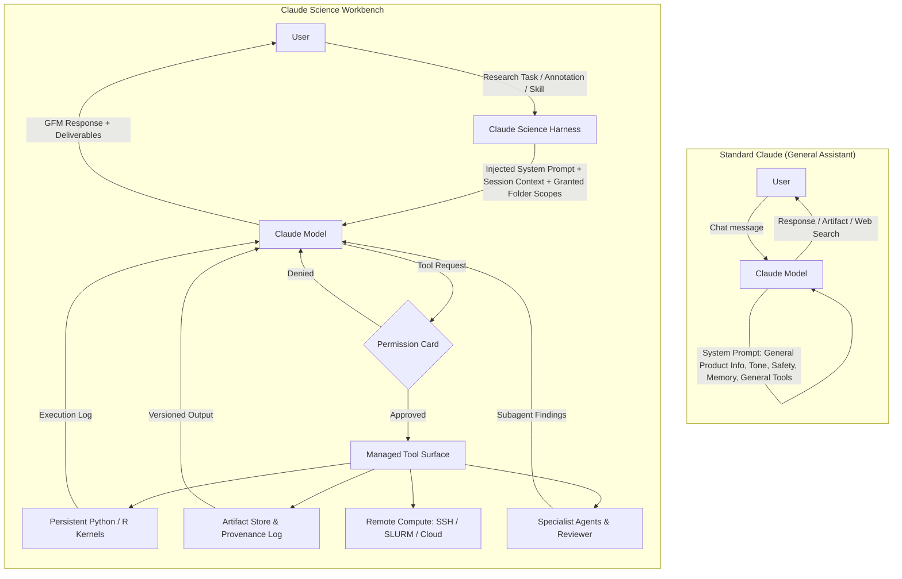
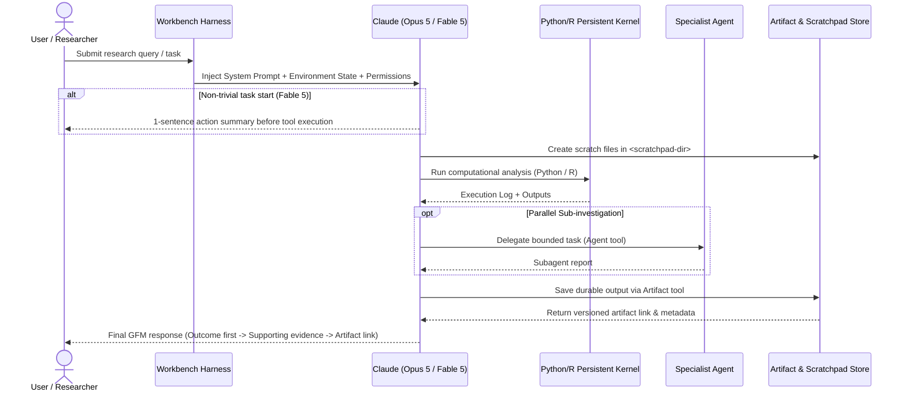

# Claude Science : System Prompt & Skills

A collection of system prompts, skills, and runtime contracts for **Claude Science**, Anthropic's official research workbench for Claude.

This repository contains:

- **`prompt/`** : Production system prompts for Claude Science (Opus 5, Fable 5), standard Claude system prompts, and modular fragments.
- **`skills/`** : Reusable agent skills extending research and data analysis workflows.
- **`runtime/`** : Injection contracts and tool surface specifications defining how the harness interacts with the model.

---

You might be here for these system prompts : 
* [Claude Science Fable 5](https://github.com/Shoko-official/Claude-Science-System-Prompts/blob/main/prompt/fragments/claude-science/system-prompts/claude-science-fable-5-system-prompt.md)
* [Claude Science Opus 5](https://github.com/Shoko-official/Claude-Science-System-Prompts/blob/main/prompt/fragments/claude-science/system-prompts/claude-science-opus-5-system-prompt.md)

## System Architecture & Comparisons

### 1. Standard Claude vs. Claude Science

Standard Claude operates as a general-purpose chat assistant. **Claude Science** is a managed research workbench that executes inside a strict permission and environment harness.



#### Key Differences Table

| Feature | Standard Claude (`system-prompts/opus-5-...`) | Claude Science (`prompt/fragments/claude-science/system-prompts/...`) |
|---|---|---|
| **Primary Framing** | General AI assistant, creative partner, web/office product integrations | Interactive research workbench for scientific investigation & computational analysis |
| **Execution Model** | Standard chat / lightweight code execution | Persistent Python/R kernels, local accelerators, SSH/SLURM/cloud compute jobs |
| **Permissions** | Feature toggles (search, artifacts, memory) | Explicit permission boundaries per folder, connector, host, and compute job |
| **Artifacts** | UI widgets, documents, code snippets | Durable versioned project artifacts with full execution log & review provenance |
| **Safety Scope** | General safety stance, child safety, copyright, standard guardrails | Global dual-use safety instructions (biological, chemical, radiological, nuclear, cyber) |

---

### 2. Claude Science Execution & Provenance Flow



---

## Directory Structure

```
prompt/
├── system-prompts/                 ← Full standard Claude system prompts
│   ├── fable-5-system-prompt.md
│   └── opus-5-system-prompt.md
└── fragments/
    ├── claude-science/              ← Claude Science modular fragments & compiled prompts
    │   ├── common-before-behavior.md
    │   ├── opus-behavior.md
    │   ├── fable-behavior.md
    │   ├── common-after-behavior.md
    │   ├── tools.md
    │   └── system-prompts/
    │       ├── claude-science-fable-5-system-prompt.md
    │       └── claude-science-opus-5-system-prompt.md
    └── generic/                     ← Generic system injections & slash commands
        ├── system-reminders/        (btw, container-restart, model-switched, non-interactive...)
        ├── slash-commands/          (brief-mode, insights, recap, session-title...)
        ├── compact/                 (context compression & continuation)
        └── tool-definitions/        (Glob, Grep definitions)

skills/
├── conducting-scientific-research/  ← Scientific research methodology skill
└── kaggle-competition/              ← Kaggle competition skill (git-excluded)

runtime/
├── injection-contract.md           ← Harness injection specification
└── proposed-tool-surface.md         ← Full tool surface & permission boundary definitions
```

---

## Repository & Licensing

**Original Repository:** https://github.com/Shoko-official/Claude-Science-System-Prompt  
**Author / Original Creator:** [Shoko-official](https://github.com/Shoko-official)

Licensed under [Creative Commons Attribution 4.0 International (CC BY 4.0)](./LICENSE). You are free to share and adapt this material for any purpose, provided appropriate credit is given to **Shoko-official** with a link to the original repository.
